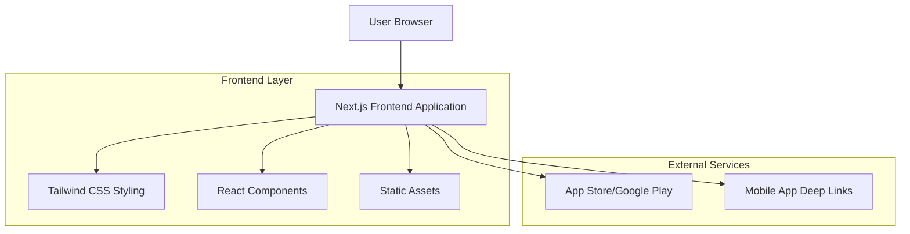

## 1. Architecture Design

## 2. Technology Description
- Frontend: Next.js@14 + React@18 + Tailwind CSS@3
- Initialization Tool: create-next-app
- Backend: None (static landing page)
- Build Tool: Next.js built-in

## 3. Route Definitions
| Route | Purpose |
|-------|---------|
| / | Landing page with all sections (hero, features, steps, etc.) |
| /privacy-policy | Privacy policy page |
| /terms-policy | Terms of service page |
| /cookie-policy | Cookie policy page |

## 4. Component Structure

### 4.1 Core Components
- `Header.tsx` - Responsive navigation with mobile menu
- `HeroSection.tsx` - Hero section with headline and CTA
- `FeatureCards.tsx` - Why Choose Jaspa section with 6 cards
- `BuiltForYouSection.tsx` - Image and text section
- `StepsSection.tsx` - 3-step process with app badges
- `ReferralSection.tsx` - Referral program section
- `FinalCTASection.tsx` - Final call-to-action
- `Footer.tsx` - Footer with navigation and legal links

### 4.2 Shared Components
- `Button.tsx` - Reusable button component with variants
- `Container.tsx` - Layout container with max-width
- `MobileMenu.tsx` - Mobile hamburger menu functionality
- `TrustBadge.tsx` - Trust badge component

## 5. Asset Management
- Images: Optimized WebP format with fallbacks
- Icons: SVG format for scalability
- App Store Badges: High-resolution PNG format
- Fonts: System fonts with web font fallbacks

## 6. Responsive Design
- Desktop: 1280px+ (full layout with side-by-side sections)
- Tablet: 768px-1279px (adjusted spacing, stacked where needed)
- Mobile: 320px-767px (fully stacked, mobile menu)

## 7. Performance Optimization
- Next.js Image component for automatic optimization
- Tailwind CSS purge for minimal bundle size
- Preload critical resources
- Lazy loading for below-fold images

## 8. Accessibility Implementation
- Semantic HTML structure
- ARIA labels for interactive elements
- Keyboard navigation support
- Focus management for mobile menu
- Screen reader announcements

## 9. Browser Compatibility
- Chrome 90+
- Firefox 88+
- Safari 14+
- Edge 90+
- Mobile browsers (iOS Safari, Chrome Android)

## 10. Deployment Configuration
- Static export for CDN deployment
- Environment variables for app store links
- Sitemap generation for SEO
- Meta tags for social sharing