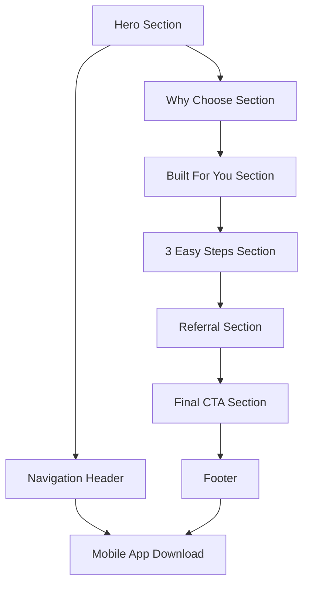

## 1. Product Overview
Jaspa MFB landing page serves as the primary web presence for a Nigerian microfinance bank, showcasing banking services and driving mobile app downloads. The landing page targets Nigerians seeking smart banking solutions with easy account opening and digital banking features.

## 2. Core Features

### 2.1 User Roles
| Role | Registration Method | Core Permissions |
|------|---------------------|------------------|
| Website Visitor | No registration required | Browse content, download mobile app, view banking information |

### 2.2 Feature Module
The landing page consists of the following main sections:
1. **Navigation Header**: responsive navigation bar with logo, menu items, and mobile hamburger menu
2. **Hero Section**: headline, subtext, trust badges, and primary CTA for account opening
3. **Why Choose Section**: 6 feature cards highlighting banking benefits
4. **Built For You Section**: image with descriptive text and secondary CTA
5. **3 Easy Steps Section**: numbered process guide with app store badges
6. **Referral Section**: referral program promotion with CTA
7. **Final CTA Section**: call-to-action with account opening button
8. **Footer**: app downloads, navigation links, social icons, legal links

### 2.3 Page Details
| Page Name | Module Name | Feature description |
|-----------|-------------|---------------------|
| Landing Page | Navigation Header | Display logo "JASPA" with two-tone styling, tagline "Bank Smart. Live Free.", navigation menu items (Personal, Business, About Us, Products & Services, Resources, Contact Us), responsive hamburger menu for mobile |
| Landing Page | Hero Section | Show headline "BANK YOUR WAY TO FINANCIAL FREEDOM" in white bold uppercase, subtext describing banking benefits, trust badges "Licensed by CBN" and "Insured by NDIC", primary CTA button "Open a Personal Account" |
| Landing Page | Why Choose Section | Display 6 feature cards with icons and titles: Flexible Savings, Instant Loans, Digital Banking, Debit Cards, Safe & Trusted, consistent card styling with dotted pattern background |
| Landing Page | Built For You Section | Show large rounded image with red curved accent, heading "A Bank Built Just For You", descriptive text about user-centric features, secondary CTA "Learn More" |
| Landing Page | 3 Easy Steps Section | Present 3 numbered steps: Download app with store badges, Sign up in minutes, Start banking, blue dotted pattern background |
| Landing Page | Referral Section | Display heading "Refer Friends, Earn Rewards", referral description text, CTA button "Refer Now in the App" |
| Landing Page | Final CTA Section | Show text "Join thousands of Nigerians already banking the smart way", primary CTA "Open a Personal Account" |
| Landing Page | Footer | App store badges, About column links, Products & Services links, Resources links, Contact Us links, social media icons, legal links (Privacy Policy, Terms Policy, Cookie Policy), copyright notice |

## 3. Core Process
Website Visitor Flow:
1. Visitor lands on homepage and views hero section
2. Visitor can navigate through different sections using header navigation or scrolling
3. Visitor can click "Open a Personal Account" CTA which links to mobile app download
4. Visitor can download mobile app via store badges in footer or 3-step section
5. Visitor can access additional information through footer navigation links

## 4. User Interface Design

### 4.1 Design Style
- Primary Colors: Deep blue background, white text, orange CTAs, red accents
- Typography: Geometric sans-serif, bold headings, regular body text, uppercase for major headers
- Button Style: Rounded corners, solid fill colors, white text on orange background
- Layout: Card-based sections, generous spacing, consistent padding
- Decorative Elements: Light dotted textures, curved red accent lines

### 4.2 Page Design Overview
| Page Section | Module Name | UI Elements |
|-------------|-------------|-------------|
| Landing Page | Navigation Header | Deep blue bar, white/red two-tone logo, pill-style buttons with light blue background and dark blue text, white navigation links |
| Landing Page | Hero Section | Blue gradient background with dotted pattern, white bold uppercase headline, trust badge capsules, orange rounded CTA button |
| Landing Page | Why Choose Section | White cards with dotted pattern, dark blue text, consistent iconography, grid layout |
| Landing Page | Built For You Section | Large rounded image with red curved accent line, dark blue heading and text, orange CTA button |
| Landing Page | 3 Easy Steps Section | Dark blue numbered circles, store badges, blue dotted pattern background |
| Landing Page | Footer | Deep blue background, white text and links, app store badges, social icons, diagonal "JASPA" watermark |

### 4.3 Responsiveness
Desktop-first design approach with mobile-adaptive breakpoints. Navigation transforms to hamburger menu on mobile. All sections stack vertically on smaller screens with appropriate spacing adjustments.

### 4.4 Accessibility Standards
- WCAG 2.1 AA compliance required
- Proper heading hierarchy and semantic HTML structure
- Strong color contrast ratios (white on deep blue, dark blue on light blue)
- Large tap targets for buttons and links
- Alt text for all images and icons
- Smooth scrolling behavior for navigation